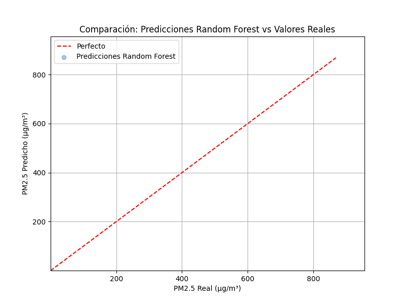

# 📊 Análisis Predictivo de la Calidad del Aire en la India (2015-2020) usando Estadística y Machine Learning 

Este proyecto es un caso práctico completo donde se analiza la **calidad del aire en ciudades de India** utilizando técnicas estadísticas y algoritmos de **Machine Learning**, aplicado en Python. Se trabaja con una base de datos real y se incluyen visualizaciones, estimaciones y un modelo predictivo robusto.

---

## 📌 Objetivos del Análisis

- Explorar los niveles de contaminación (PM2.5) en diferentes ciudades.
- Aplicar **Estimación por Máxima Verosimilitud (MLE)** a la distribución de PM2.5.
- Construir un modelo de **Regresión Lineal por Mínimos Cuadrados (OLS)**.
- Implementar un modelo de **Random Forest Regressor** para predicción.
- Visualizar los resultados mediante gráficos y una animación GIF.

---

## 🗃️ Datos utilizados

- **Archivo:** `air-quality-data.zip`
- **Fuente original:** [India Air Quality Data - Kaggle](https://www.kaggle.com/datasets/shrutibhargava94/india-air-quality-data)
- **Variables clave:** PM2.5, PM10, NO2, CO, entre otras.

---

## 🛠️ Tecnologías y librerías

- Python
- Pandas, NumPy
- Seaborn, Matplotlib
- Scikit-learn
- Statsmodels
- SciPy

---

## 🧪 Archivo principal

📓 **Notebook:**  
[`CASO_APLICADO_Análisis_de_Calidad_del_Aire.ipynb`](CASO_APLICADO_Análisis_de_Calidad_del_Aire.ipynb)

---

## 🎞️ Animación generada

Una animación en formato GIF que compara predicciones vs valores reales del modelo Random Forest:

---

## 💬 Notas adicionales

Este análisis fue desarrollado en Google Colab como parte de un portafolio personal de Ciencia de Datos. Incluye descripciones paso a paso y justificaciones estadísticas, ideal para quienes están aprendiendo o quieren ver ejemplos reales.

---

## ⚖️ Licencia

Este proyecto se publica bajo la **Licencia MIT**.  
Consulta el archivo [LICENSE](LICENSE) para más detalles.

---

📚 *Desarrollado por Gladys Choque Ulloa | Ciencia de Datos & Estadística Aplicada*  
🔗 Sígueme en mis Redes Sociales (https://linktr.ee/gladyschoqueulloa) para más contenidos sobre datos.

